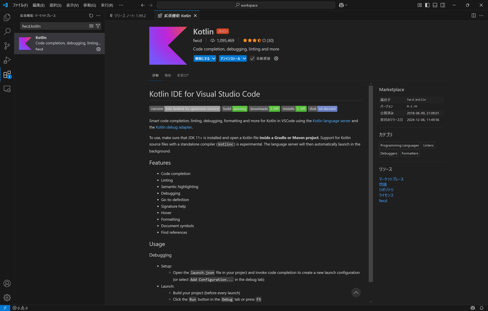

# 構築手順
## VScode拡張
1. プラグイン「Kotlin」のインストール

1. プラグイン「Spring Boot Extension Pack」のインストール

1. プラグイン「Gradle for Java」のインストール

1. プラグイン「Extension Pack for Java」のインストール

## Ansible実行手順　～インフラ構築～
[Ansible実行手順書](./doc/ansible/Ansible実行手順書.md)

## Dockerコンテナの起動　～データベースサーバの起動～
[docker手順書](./doc//postgres/docker手順書.md)

## Javaプロジェクト起動手順
1.VSCodeの左上部「・・・」を押下し、「ターミナル」を選択
2.「タスクの実行」を押下
3.「run」を実行